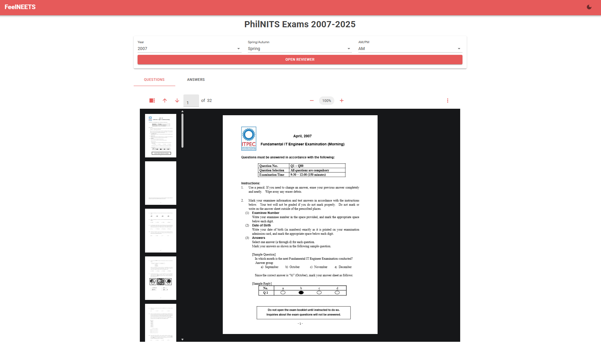

# FeelNEETS
**Live demo: [https://greturn.github.io/FeelNeets/](https://greturn.github.io/FeelNeets/)**

A website storing PhilNITS reviewers -- questionnaires and answer sheets from 2007 to 2025.

you can just download them directly from the [PhilNITS website](https://itpec.org/pastexamqa/fe.html), but I just wanted an excuse to work with Blazor WASM.

PS. This was a weekend project. Don't judge my UI too much huhuhu
